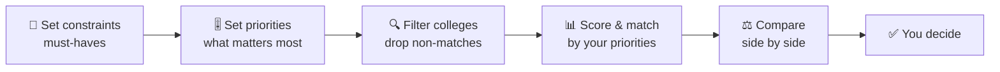

<div align="center">

# 🎓 OrGyo

### Don't search for the *best* college. Find the one that's best **for you.**

*A preference-based college discovery, comparison and matching platform.*

[](#-status)
[](#-tech-stack)
[](#-documentation)
[](#-license)
[](#-contributing)

</div>

---

## 🧭 What is OrGyo?

Choosing a college usually means juggling a dozen websites, comparing fees and placements by hand, trusting random reviews, and sometimes visiting campuses just to get a feel for the place. And every student cares about something different:

- 🧑‍🎓 One student wants a college **within 10 km**, with **low fees** and a **hostel**.
- 🧑‍💻 Another wants **strong placements**, **hackathons**, **great faculty** and a **technical culture**.

A generic "Top 10 Colleges" list can't serve both. **OrGyo can.**

You tell OrGyo what's non-negotiable and what matters most. OrGyo filters out colleges that don't fit and surfaces the ones that align most closely with *your* requirements. Two students will get two different results, and that's the point.

> ⚖️ OrGyo never claims to know the "objectively best" college. It shows what matches **your** priorities. The final decision is always yours.

---

## 📖 Table of Contents

- [How It Works](#-how-it-works)
- [Example](#-example)
- [Key Features](#-key-features)
- [Where the Data Comes From](#-where-the-data-comes-from)
- [Verification & Trust](#-verification--trust)
- [What OrGyo Is Not](#-what-orgyo-is-not)
- [Vision](#-vision)
- [Roadmap](#️-roadmap)
- [Tech Stack](#-tech-stack)
- [Documentation](#-documentation)
- [Getting Started](#-getting-started)
- [Contributing](#-contributing)
- [Status](#-status)
- [License](#-license)

---

## ⚙️ How It Works



**1. Constraints (mandatory).** Conditions a college *must* satisfy to be considered: maximum distance, fee range, required course, preferred location, required facilities.

**2. Preferences and priorities (weighted).** Factors you care about, each with your own level of importance: placements, faculty, infrastructure, curriculum, technical events, hackathons, research, internships, campus environment and more.

**3. Match.** OrGyo filters by your constraints, then evaluates the remaining colleges against your weighted priorities. The result is a **College Match**: how well each college fits *you*, not a universal rank.

---

## 💡 Example

```text
Course:        B.Tech Computer Science
Max distance:  10 km from home
Max fees:      ₹2 lakh / year

Priorities (high → low):
  1. Placement performance
  2. Faculty quality
  3. Technical events & hackathons
  4. Infrastructure
  5. Academic curriculum
```

**A different student, a different result:**

```text
Course:        BBA
Must have:     Hostel
Priorities:    Low fees  >  Campus environment  >  Location  >  Placements
```

Same platform, same data, completely different matches.

---

## ✨ Key Features

| Feature | What it does |
|---|---|
| 🎯 **Preference-Based Matching** | Set hard constraints and weighted priorities; get results tailored to you |
| 🔍 **Search & Filter** | Find colleges and courses by distance, fees, location, facilities and more |
| ⚖️ **Side-by-Side Comparison** | Compare multiple colleges across the parameters you choose |
| 🎚️ **Custom Priorities** | Give different levels of importance to different parameters |
| 📚 **Rich College Profiles** | Courses, faculty, infrastructure, curriculum, fees, placements, campus life, technical events, competitions |
| 💬 **Community Insights** | Feedback from current students, alumni, faculty and staff |
| ✅ **Verified Contributors** | Contributors' association with a college is verified, and the status is shown |
| 🏷️ **Source Transparency** | See where each piece of information came from and its verification status |
| 🔌 **Built to Extend** | Architecture designed for future preference-based discovery use cases |

---

## 🌐 Where the Data Comes From

OrGyo builds college profiles from two kinds of sources, and always keeps them distinguishable.

| 👥 Community Data | 🏛️ External Data |
|---|---|
| Current students | Official college & university websites |
| Alumni | Government & public education databases |
| Faculty & staff | Other legitimate, permitted external sources |
| Others associated with the college | |

---

## 🛡️ Verification & Trust

Trust is a core design goal, so OrGyo is upfront about what verification means.

- ✅ **Verified** means OrGyo has confirmed the contributor's *association* with the college through its verification process.
- ❌ It does **not** mean every opinion or statement is objectively true.
- 🏷️ Information is labelled by **source** and **verification status**, so you can judge it yourself.
- ⭐ Input from verified contributors may carry more relevance in appropriate areas, while official and external data is kept according to its own source.

---

## 🚫 What OrGyo Is Not

To keep expectations honest, OrGyo (initial version) will **not**:

- Guarantee admission to any college or institute
- Run admissions, exams, counselling or document verification
- Make admission decisions, or make your final choice for you
- Claim any college is the best choice for everyone
- Guarantee the accuracy of every user-generated opinion
- Replace physical visits where they are needed
- Include job search or recruitment features (not yet, see below)

---

## 🔭 Vision

The first version focuses on **college and educational institute discovery**. But the idea behind OrGyo, *"tell us what matters to you and we'll find what fits,"* applies far beyond education.

Possible future directions (not part of the initial version):

- 💼 **Job & career discovery** based on skills, qualifications, location and salary expectations
- 🏢 **Organization & company discovery** using user-defined criteria
- 🧩 **Other decision-support tools** built on preference-based search, comparison, verification and matching

---

## 🗺️ Roadmap

**Phase 1: Core college discovery** *(initial version)*
- [ ] Search colleges and courses
- [ ] Constraints: distance, fees, course, location, facilities
- [ ] Weighted preference and priority system
- [ ] Preference-based College Match results
- [ ] College profile pages (courses, faculty, infrastructure, curriculum, fees, placements, campus life)
- [ ] Multi-college comparison

**Phase 2: Community & trust**
- [ ] Contributor verification (students, alumni, faculty, staff)
- [ ] Community feedback and reviews
- [ ] Source and verification labels on all data
- [ ] Ingestion of official and public data sources

**Phase 3: Beyond colleges** *(future)*
- [ ] Job and career opportunity discovery
- [ ] Organization discovery
- [ ] Other preference-based decision-support use cases

---

## 🧱 Tech Stack

> _To be decided._

| Layer | Technology |
|---|---|
| Frontend | — |
| Backend | — |
| Database | — |
| Hosting | — |

---

## 📄 Documentation

The project is being planned around a **Software Requirements Specification (SRS)**, currently covering:

1. Introduction (purpose, scope, out of scope, definitions, references, overview)
2. *System description, functional and non-functional requirements, and more coming next*

---

## 🚀 Getting Started

> _Setup instructions will be added once the tech stack is finalized._

```bash
# Clone the repository
git clone https://github.com/<your-username>/orgyo.git
cd orgyo
```

---

## 🤝 Contributing

Ideas, feedback and contributions are welcome, from tech to data to design.

1. Fork the repository
2. Create your feature branch (`git checkout -b feature/amazing-feature`)
3. Commit your changes (`git commit -m 'Add some amazing feature'`)
4. Push to the branch (`git push origin feature/amazing-feature`)
5. Open a Pull Request

---

## 📌 Status

🌱 **Early stage.** The concept, scope and requirements (SRS) are being defined before development begins.

## 📄 License

> _License to be decided._

---

<div align="center">

**Your priorities. Your colleges. Your decision.** 🎓

</div>
